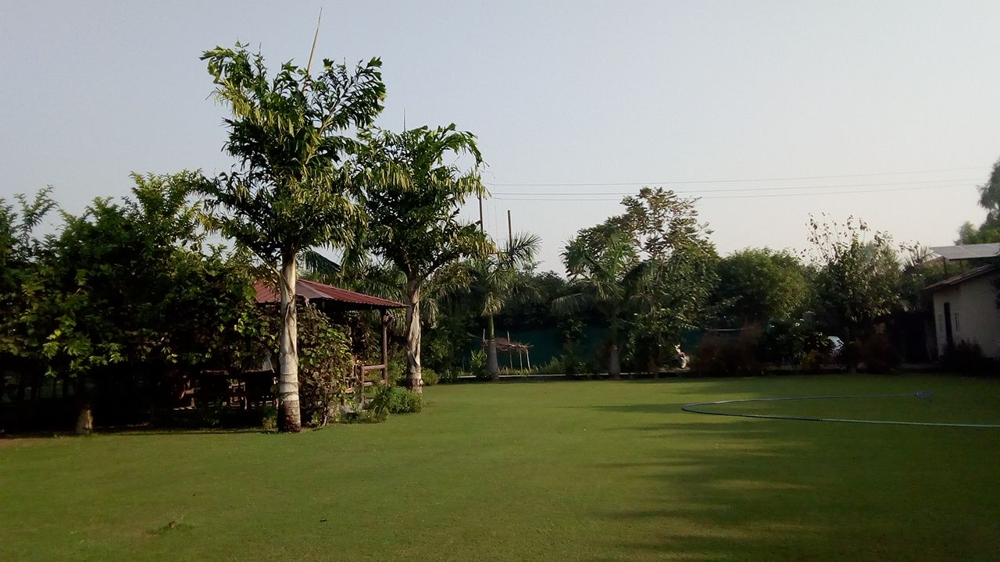

# श्यामकुटीर स्मृति उद्यान (Shyam Kutir Farm) 

**आयुर्वेदिक स्वस्थ जीवन के आधार**

**शुद्ध पुष्प, फल, सब्जी, धूप, हवा और शान्ति को सादर समर्पित**

**गोलोक निवासी पूज्य दादाजी वैद्य श्री श्याम लाल रस्तोगी की स्मृति में।** 

**Named in the honor of grandfather late Vaidya Shri Shyam Lal Rastogi.**

## प्रभात (Morning At Farm 2021-10-30)

## उद्यान उत्पाद (Farm Produce) 

## चलचित्र (Video Clips)

[VID_20211030_01](VID_20211030_01.mp4)

[VID_20211030_02](VID_20211030_02.mp4)

[VID_20211030_03](VID_20211030_03.mp4)
